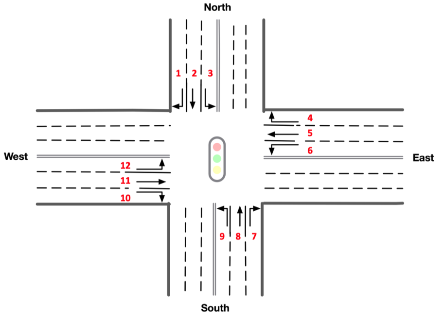
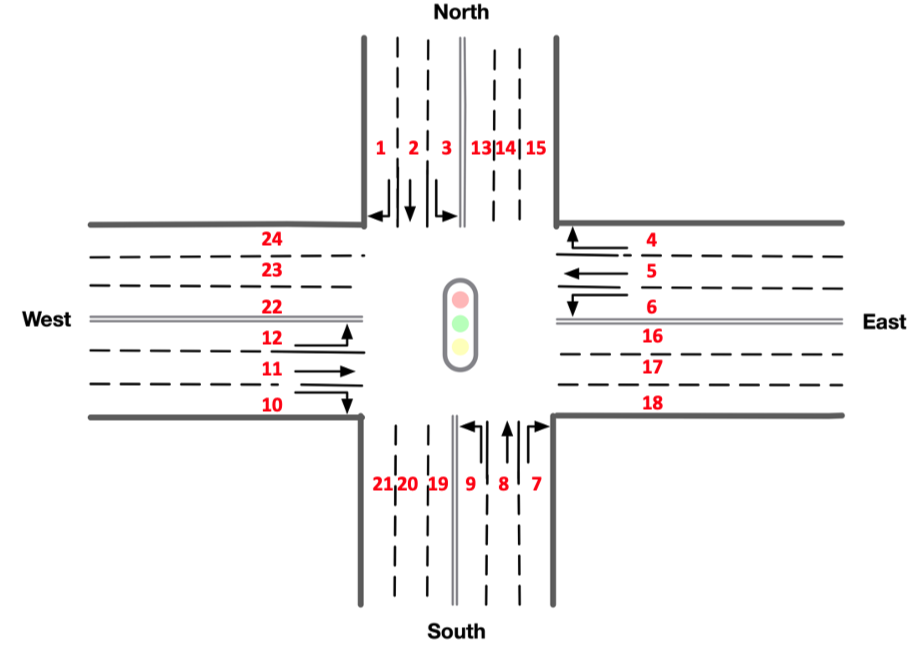
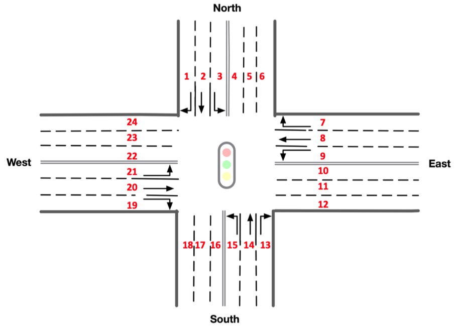
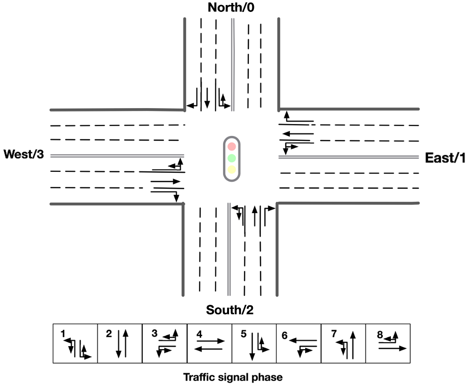
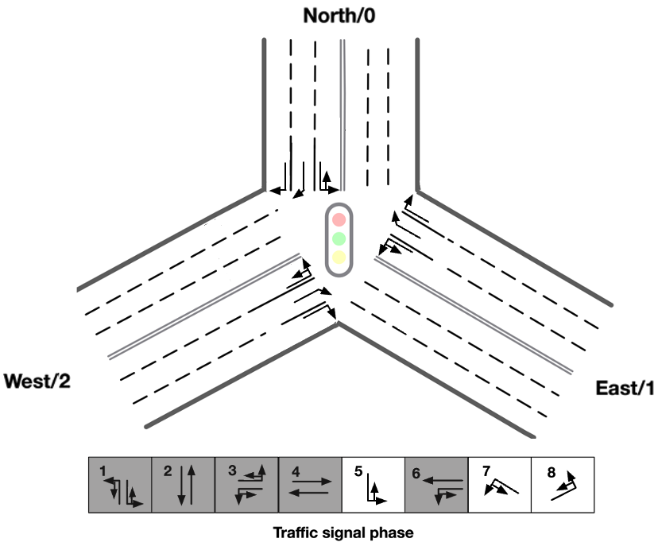
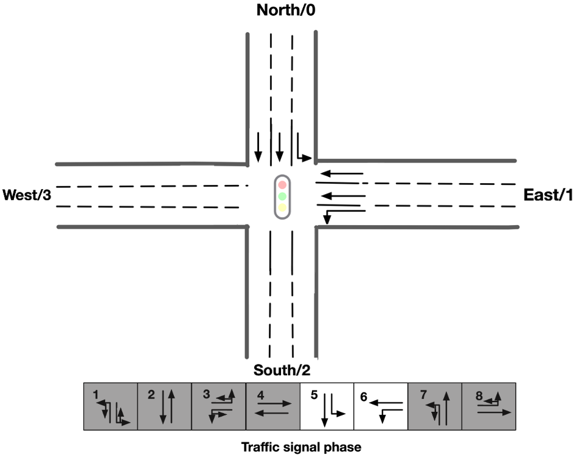

## General traffic signal Control Agent - Observations, Actions and Rewards

### Observation

<!-- start observation -->

The default observation for each traffic signal agent is a vector:

```python
    obs = [phase_one_hot, min_green, lane_1_density, ..., lane_n_density, lane_1_queue, ..., lane_n_queue]
```

- ```phase_one_hot``` is a one-hot encoded vector indicating the current active green phase
- ```min_green``` is a binary variable indicating whether min_green seconds have already passed in the current phase
- ```lane_i_density``` is the number of vehicles in incoming lane i dividided by the total capacity of the lane
- ```lane_i_queue```is the number of queued (speed below 0.1 m/s) vehicles in incoming lane i divided by the total
  capacity of the lane

You can define your own observation by implementing a class that inherits
from [ObservationFunction](https://github.com/Xiangxiangzhu/general-tls/blob/main/src/environment/observations.py) and
passing it to the environment constructor.

Below are the predefined observation functions. 
```python
    [r_turn_veh, s_turn_veh, l_turn_veh]
```
To achieve a generalized state representation, the state for each incoming road is composed of three elements. For roads with multiple lanes dedicated to left-turn, straight, or right-turn, the state of that specific lane is determined by the maximum number of vehicles present on it.

In [observations.py](https://github.com/Xiangxiangzhu/general-tls/blob/main/src/environment/observations.py), 
we provide three general observation functions with different lane sorting order:

**DefaultObservationFunction**
<p align="center">

</p>

**FullAttachObservationFunction**
<p align="center">

</p>

**FullClockwiseObservationFunction**
<p align="center">

</p>


<!-- end observation -->

### Action

<!-- start action -->

The action space is discrete.
Every 'delta_time' seconds, each traffic signal agent can choose the next green phase configuration.

For the general traffic light control agent, the action space is set to |A| = 8 standard discrete actions. In different
scenarios, some of these 8 actions may not be executable or may have different meanings.

E.g.1: In the standard **4-way single intersection** there are 8 legal discrete actions, corresponding to the following
green phase configurations:


<p align="center">

</p>

E.g.2: In the standard **3-way single intersection** among 8 discrete actions, only 3 of them are legal, corresponding
to the following green phase configurations:
Note that the phase 7 and phase 8 are of different meaning while still remain as similar as possible to the original
standard phase.

<p align="center">

</p>

E.g.3: In a **2-way single intersection**, among 8 discrete actions, 6 of them are illegal and being masked during
action selection, corresponding phase configurations is shown as:

<p align="center">

</p>

Important: every time a phase change occurs, the next phase is preeceded by a yellow phase lasting ```yellow_time```
seconds.

####  Green Phase Customization

You can customize green phase
in [traffic_signal.py](https://github.com/Xiangxiangzhu/general-tls/blob/main/src/environment/traffic_signal.py
):

|   |   |   |   |   |   |   |   |
|---|---|---|---|---|---|---|---|
| 0 | 1 | 3 | 3 | 2 | 3 | 3 | 3 |
| 3 | 3 | 0 | 1 | 3 | 2 | 3 | 3 |
| 0 | 1 | 3 | 3 | 3 | 3 | 2 | 3 |
| 3 | 3 | 0 | 1 | 3 | 3 | 3 | 2 |

Phase Key of a Single Road:
- 0: Left turn
- 1: Straight way
- 2: Left turn & straight way phase
- 3: Stop phase

Each row in the table represents the phase settings for one of the four incoming roads. A single line depicts the entire phase for a traffic light signal (TLS).

####  Action Mask Customization
You can customize action masks in **observation_space** method
at [observations.py](https://github.com/Xiangxiangzhu/general-tls/blob/main/src/environment/observations.py
) like:
```python
action_mask[0:4] = 0
```

<!-- end action -->

### Rewards

<!-- start reward -->

The default reward function is the change in cumulative vehicle delay:

That is, the reward is how much the total delay (sum of the waiting times of all approaching vehicles) changed in
relation to the previous time-step.

You can choose a different reward function (see the ones implemented
in [TrafficSignal](https://github.com/Xiangxiangzhu/general-tls/blob/main/src/environment/traffic_signal.py)) with the
parameter `reward_fn` in
the [SumoEnvironment](https://github.com/Xiangxiangzhu/general-tls/blob/main/src/environment/env.py) constructor.

It is also possible to implement your own reward function:

```python
def my_reward_fn(traffic_signal):
    return traffic_signal.get_average_speed()


env = SumoEnvironment(..., reward_fn=my_reward_fn)
```

<!-- end reward -->