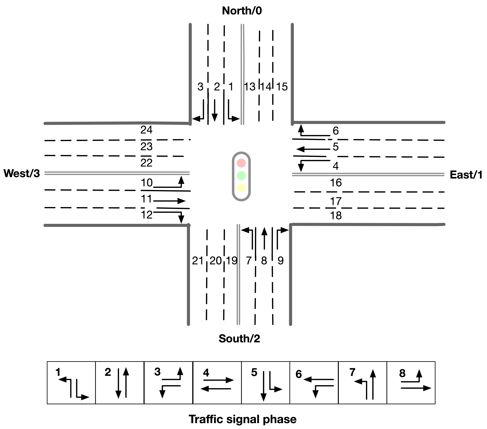

## MDP - Observations, Actions and Rewards

### Observation

<!-- start observation -->

<p align="center">

</p>

The default observation for each traffic signal agent is a vector:
```python
    obs = [phase_one_hot, min_green, lane_1_density,...,lane_n_density, lane_1_queue,...,lane_n_queue]
```
- ```phase_one_hot``` is a one-hot encoded vector indicating the current active green phase
- ```min_green``` is a binary variable indicating whether min_green seconds have already passed in the current phase
- ```lane_i_density``` is the number of vehicles in incoming lane i dividided by the total capacity of the lane
- ```lane_i_queue```is the number of queued (speed below 0.1 m/s) vehicles in incoming lane i divided by the total capacity of the lane

You can define your own observation by implementing a class that inherits from [ObservationFunction](https://github.com/LucasAlegre/sumo-rl/blob/main/sumo_rl/environment/observations.py) and passing it to the environment constructor.

<!-- end observation -->

### Action

<!-- start action -->

The action space is discrete.
Every 'delta_time' seconds, each traffic signal agent can choose the next green phase configuration.

E.g.: In the [2-way single intersection](https://github.com/LucasAlegre/sumo-rl/blob/main/experiments/dqn_2way-single-intersection.py) there are |A| = 4 discrete actions, corresponding to the following green phase configurations:

<p align="center">

</p>

Important: every time a phase change occurs, the next phase is preeceded by a yellow phase lasting ```yellow_time``` seconds.

<!-- end action -->

### Rewards

<!-- start reward -->

The default reward function is the change in cumulative vehicle delay:

That is, the reward is how much the total delay (sum of the waiting times of all approaching vehicles) changed in relation to the previous time-step.

You can choose a different reward function (see the ones implemented in [TrafficSignal](https://github.com/LucasAlegre/sumo-rl/blob/main/sumo_rl/environment/traffic_signal.py)) with the parameter `reward_fn` in the [SumoEnvironment](https://github.com/LucasAlegre/sumo-rl/blob/main/sumo_rl/environment/env.py) constructor.

It is also possible to implement your own reward function:

```python
def my_reward_fn(traffic_signal):
    return traffic_signal.get_average_speed()

env = SumoEnvironment(..., reward_fn=my_reward_fn)
```

<!-- end reward -->